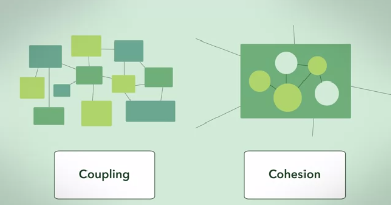

    /*
    Cohesion
    is a measure of the number of relationships
    that parts of a component have with each other.
    High cohesion means that all of the parts
    that are needed to deliver the component's functionality
    are included in the component

    Coupling
    is a measure of the number of relationships
    that one component has with other components in the system.
    Low coupling means that components
    do not have many relationships with other components

     */

    /*
    A modern auto plant can be used to illustrate the concepts of coupling and cohesion.
    Each worker within the plant has one specific job, like mounting a cylinder head on an engine.
    This is an example of cohesion.
    The worker does one thing and does it the same way every time.
    The worker doesn't have any idea about the vehicle in which the engine will be installed.

    The engine, when completed, might be used in a 2 door coupe or it may go in a small truck.
    The engine doesn't care which vehicle it's installed in and the vehicle doesn't care which engine is used.
    The connections between the engine and the vehicle are designed to as be GENERIC as possible
    and the engine specific connection points are minimized.
    This is an example of low coupling.
     */